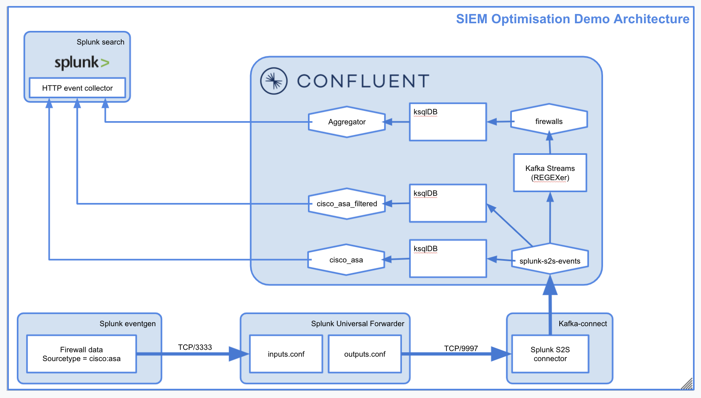
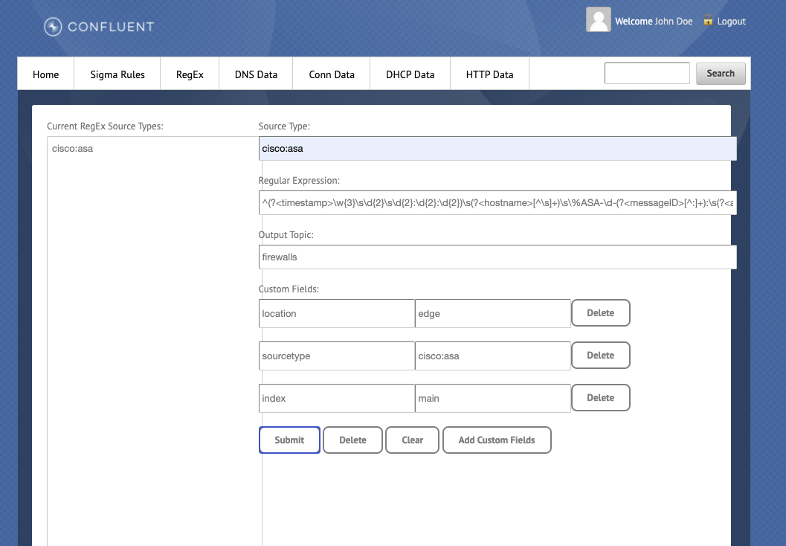
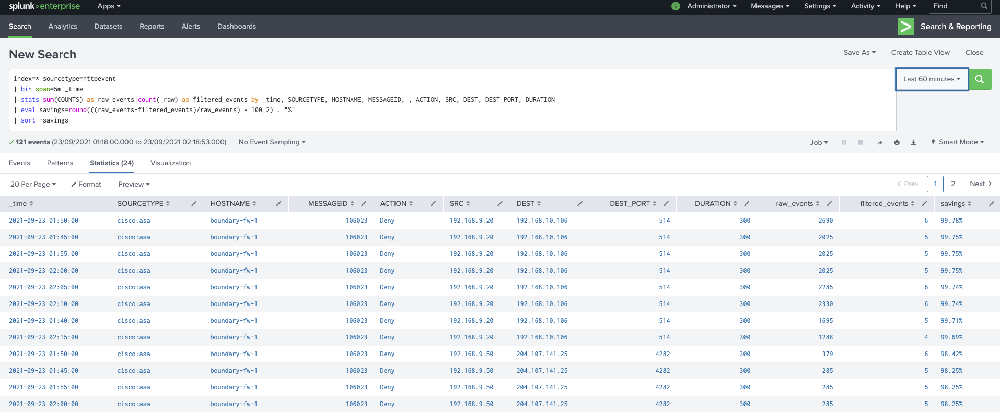

# Confluent Splunk-2-Splunk Source Demo

The purpose of this project is to provide a demonstration on how to optimize your Splunk data ingestion by using Confluent. This guide will route data from a Splunk Universal Forwarder running an eventgenerator, to the Confluent Splunk-2-Splunk Source Connector while bypassing the Splunk indexing layer and retaining all of the critical metadata assosciated with each data source (source, sourcetype, host, event, _meta). 

<p align="center">
   
</p>

As the data is flowing through Confluent, Kafka Streams and KsqlDB will run and output the following use cases, which will then be consumed from the Confluent managed Splunk Sink Connector:
- Filter out of noisy meassages
- Deduplicate and sum like events over a window period
- Remove unnecsary fields and reduce message size
The Confluent managed Splunk Sink Connector uses the Splunk HTTP Event Collector (HEC) as and endpoint to push the data to. Here is a visual representation of the end-to-end flow.

To handle unstructured data the Sigma stream processor (https://github.com/confluentinc/kafka-sigma) application is used which enables a RegEx function through a web UI. This allows you to enter your RegEx'es to create key/value pairs out of named capture groups, matching to a splunk sourcetype. Here is a screenshot of the web UI.

<p align="center">
   
</p>

For more ksqldb Cyber Security or SIEM use cases inclduing: enriching data streams, Matching host names in a watchlist or to analyse syslogs events, refer to this CP-SIEM demo to learn more https://github.com/berthayes/cp-siem

To get started, and if you are following allong on a local development environment, preferably on a linux os, you will need git cli, docker and docker-compose (if you haven't already). Also if possible, ensure you have reserved 8GB of ram to Docker as minium to run the instances.

This demo is using the cisco:asa sample logs from the Splunk Boss of the SOC (BOTS) Version 3 Dataset (https://github.com/splunk/botsv3), and will replay random events with a event generator to a Splunk Universal Forwarder.


## Running on localhost
```
1. git clone https://github.com/JohnnyMirza/confluent_splunk_demo.git
2. cd confluent_splunk_demo 
3. docker-compose up -d
```
Wait about 5 minutes or so for everything to start up, then point your web browser to http://localhost:9021 for Confluent Control Center and http://localhost:8080 for the Sigma Rule UI.

## Running on an external host
To run this environment on a system that is not your laptop/workstation, edit the docker-compose.yml file.

Look for this line:
```
CONTROL_CENTER_KSQL_KSQLDB1_ADVERTISED_URL: "http://localhost:8088"
```
And change it to something like this:
```
CONTROL_CENTER_KSQL_KSQLDB1_ADVERTISED_URL: "http://yourhost.yourdomain.com:8088"
```
Then start up docker as above with:
```
docker-compose up -d
```
Wait about 5 minutes or so for everything to start up, then point your web browser to http://yourhost.yourdomain.com:9021 for Confluent Control Center and http://yourhost.yourdomain.com::8080 for the Sigma Rule UI.

## Demo Script
### Lets Examine the data streamin in.

- As mentioned above, the cisco:asa logs are used for the demo
- Go to localhost:9021 (or remote host URL)
- Click on the Cluster->Topics->splunk-s2s-events
- Observer the messages spooling, and the click the pause button and switch to card view
- Look a specific record by expanding and then scroll through the fields
- Notice the Splunk metadata fields (source, sourcetype, host, event, _meta)

### Lets examine and publish a sigma RegEx rule
- Go to localhost:8080 for the Sigma RegEx Rule UI and click on the RegEx tab
- Create the new RegEx rule for cisco:asa with the following example (refer to image above if needed)
  - ```
    sourcetype = cisco:asa
    Regular Expression = ^(?<timestamp>\w{3}\s\d{2}\s\d{2}:\d{2}:\d{2})\s(?<hostname>[^\s]+)\s\%ASA-\d-(?<messageID>[^:]+):\s(?<action>[^\s]+)\s(?<protocol>[^\s]+)\ssrc\sinside:(?<src>[0-9\.]+)\/(?<srcport>[0-9]+)\sdst\soutside:(?<dest>[0-9\.]+)\/(?<destport>[0-9]+)
    Output Topic = firewalls
    Add the Custom Fields
    --location = edge
    --sourcetype = cisco:asa
    --index = main
    ```
- The above RegEx will filter on the sourcetype=cisco:asa value from the splunk-s2s-events topic and then apply the RegEx string to the event field (which is the raw message). The RegEx will create the named capture groups as key/value pairs in the firewalls topic. For example: timestamp, hostname, messageID will be extracted as the key, and the RegEx in the group will be its value.
- Navitage back to localhost:9021->Cluster-Topics
- You should now notice a new topic called firewalls
- Exam the data in firewalls topic and you should see the above mentioned keys and values

### Query the Data with KsqlDB
- From Control Center, navigate to KsqlDB and go to the editor
- Create a new Splunk Stream from the splunk-s2s-events topic
  - ```
    CREATE STREAM SPLUNK (
    `event` VARCHAR,
    `time` BIGINT,
    `host` VARCHAR,
    `source` VARCHAR,
    `sourcetype` VARCHAR,
    `index` VARCHAR
    ) WITH (
    KAFKA_TOPIC='splunk-s2s-events', VALUE_FORMAT='JSON');
    ```
- Lets also filter out all of the Splunk internal logs, and only focus on the cisco:asa sourcetype
  - ``` 
    CREATE STREAM CISCO_ASA as SELECT
    `event`,
    `source`,
    `sourcetype`,
    `index`  FROM SPLUNK
    where `sourcetype` = 'cisco:asa'
    EMIT CHANGES;
    ```
- Navigate to Flow and exam the data in the CISCO_ASA stream. This is all of the raw cisco asa logs and can be consumed by a s3 or elastic search sink connector to redistibute the data. Refer to this link for an example https://github.com/JohnnyMirza/splunk_forward_to_kafka
- The noisy event we are filtering is messageID %ASA-4-106023, use KsqlDb to filter out the event
-  ```
   CREATE STREAM CISCO_ASA_FILTER_106023 WITH (KAFKA_TOPIC='CISCO_ASA_FILTER_106023', PARTITIONS=1, REPLICAS=1) AS SELECT
   SPLUNK.`event` `event`,
   SPLUNK.`source` `source`,
   SPLUNK.`sourcetype` `sourcetype`,
   SPLUNK.`index` `index`
   FROM SPLUNK SPLUNK
   WHERE ((SPLUNK.`sourcetype` = 'cisco:asa') AND (NOT (SPLUNK.`event` LIKE '%ASA-4-106023%')))
   EMIT CHANGES;
   ```
- The new filtered stream 'CISCO_ASA_FILTER_106023' will sink the reduced logs to the Splunk instance using HEC
- Next create a new Stream for the Firewalls data (the events that were extracted with the Sigma RegEx application)
  - ```
    CREATE STREAM FIREWALLS (
    `src` VARCHAR,
    `messageID` BIGINT,
    `index` VARCHAR,
    `dest` VARCHAR,
    `hostname` VARCHAR,
    `protocol` VARCHAR,
    `action` VARCHAR,
    `srcport` BIGINT,
    `sourcetype` VARCHAR,
    `destport` BIGINT,
    `location` VARCHAR,
    `timestamp` VARCHAR
    ) WITH (
    KAFKA_TOPIC='firewalls', value_format='JSON', KEY_FORMAT='JSON'
    );
    ```
### Finally, create a window aggregation table to dedupe events by Group
  - ``` 
    CREATE TABLE AGGREGATOR WITH (KAFKA_TOPIC='AGGREGATOR', KEY_FORMAT='JSON', PARTITIONS=1, REPLICAS=1) AS SELECT
    `hostname`,
    `messageID`,
    `action`,
    `src`,
    `dest`,
    `destport`,
    `sourcetype`,
    as_value(`hostname`) as hostname,
    as_value(`messageID`) as messageID,
    as_value(`action`) as action,
    as_value(`src`) as src,
    as_value(`dest`) as dest,
    as_value(`destport`) as dest_port,
    as_value(`sourcetype`) as sourcetype,
    TIMESTAMPTOSTRING(WINDOWSTART, 'yyyy-MM-dd HH:mm:ss', 'UTC') TIMESTAMP,
    60 DURATION,
    COUNT(*) COUNTS
    FROM FIREWALLS FIREWALLS
    WINDOW TUMBLING ( SIZE 60 SECONDS ) 
    GROUP BY `sourcetype`, `action`, `hostname`, `messageID`, `src`, `dest`, `destport`
    EMIT CHANGES;
    ```
### Visualise the data in Splunk
  - Login to the splunk instance, if running locally: http://localhost:8000/en-GB/app/search/search (admin/Password1)
  - In the search bar run ``` index=* ```
  - The events will appear below the search bar
  - Click on sourcetype and you should see two values: 'cisco:asa' and 'httpevent'
    - The 'cisco:asa' sourcetype is the filtered 'CISCO_ASA_FILTER_106023' stream
    - The 'httpevent' is the AGGREGATOR topic
  - Run the below Splunk search query to compare and visualise the filtered and Aggregator events
    - ```
      index=* sourcetype=httpevent
      | bin span=5m _time
      | stats sum(COUNTS) as raw_events count(_raw) as filtered_events by _time, SOURCETYPE, HOSTNAME, MESSAGEID, , ACTION, SRC,     DEST, DEST_PORT, DURATION
      | eval savings=round(((raw_events-filtered_events)/raw_events) * 100,2) . "%" 
      | sort -savings 
      ```
   - Here is a example of the data reducution from the AGGREGATOR topic in Splunk. Note this is event generated data and might not reflect a production environments
<p align="center">

</p> 


### Thanks To
*Phil Wild (https://github.com/pwildconfluentio) for helping this put together.*
*Michael Peacock (https://github.com/michaelpeacock) who created the Sigma RegEx App*

### TroubleShooting:
- If the 'firewall's topic above does not apear after the regex, try and restart the Sigma RegEx app
   ```
   docker restart cyber-sigma-regex-ui
   ```
- If there are no events after running the KsqlDB queries, ensure all of the fields are correct, and that you have added the custom fields in the Sigma RegEx
- The following docker images will be configured as part of this demo:   
   ```
   Name
   ----------------
   broker
   control-center
   cyber-sigma-RegEx-ui
   cyber-sigma-streams
   kafka-connect
   ksqldb
   schema-registry
   splunk_eventgen
   splunk_search
   splunk_uf1
   zookeeper
   ```
  
